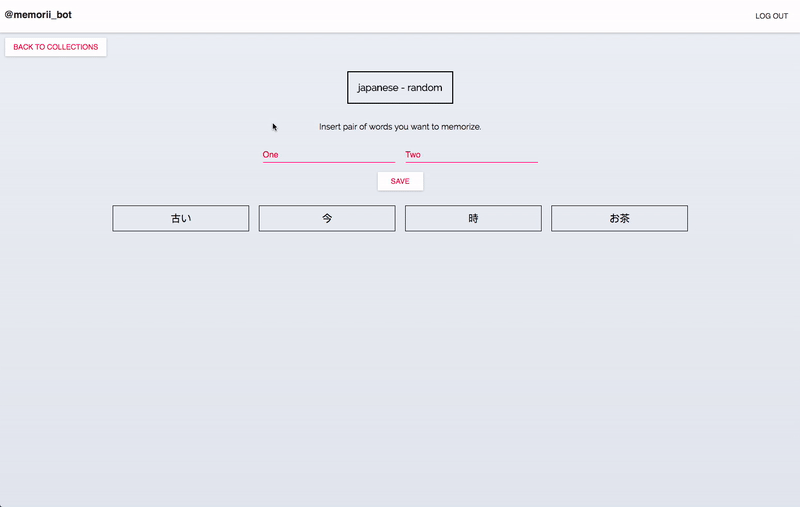

# Memorii

> Front-end for Telegram bot which helps with words memorizing.

Installation
----

+ Follow installation steps of [memorii-backend](https://github.com/KarinaDavtyan/memorii-backend)
+ Run commands :arrow_down:

`git clone https://github.com/KarinaDavtyan/memorii.git`

`cd memorii`

`yarn install`

To find out more about bot itself, go the memorii-bot repo [here](https://github.com/KarinaDavtyan/memorii-bot)

Usage
----
+ Create your account
+ Add words you want to memorize into collections

+ Forward to [Telegram](https://telegram.me/memorii_bot) to start your learning sprints with @memorii_bot

Tech-stack
----

+ React + Redux
+ Material-UI

Contributing
----

+ Fork the repo (https://github.com/KarinaDavtyan/memorii/fork)
+ Clone it
+ Create your feature branch
+ Commit changes to your own branch
+ Push to the branch
+ Create a new Pull Request
